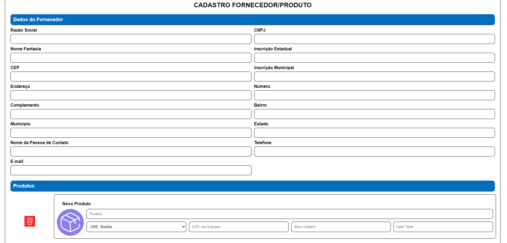
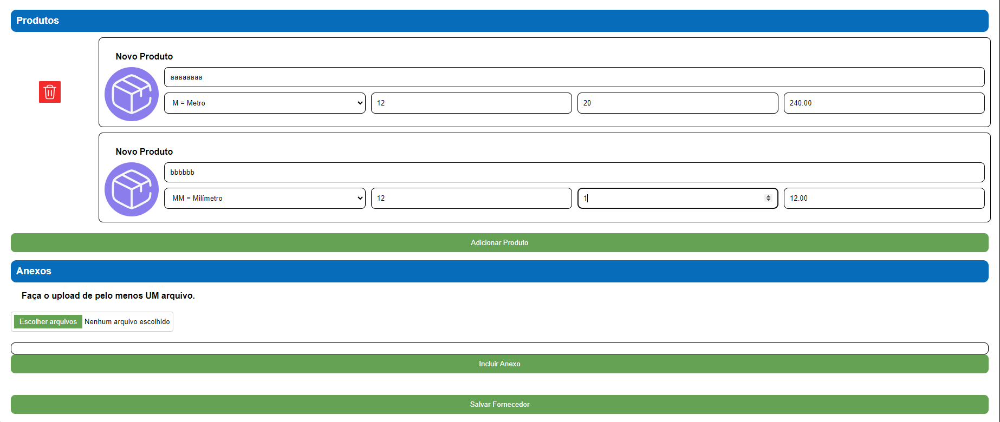
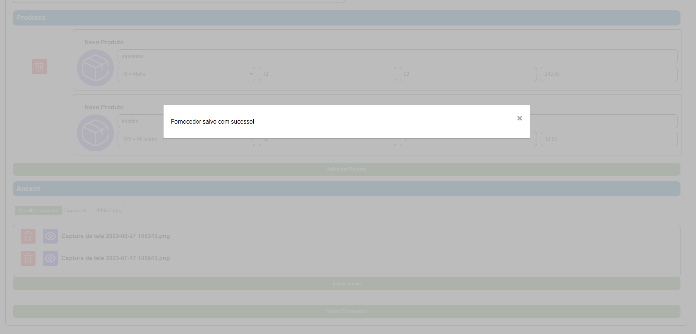
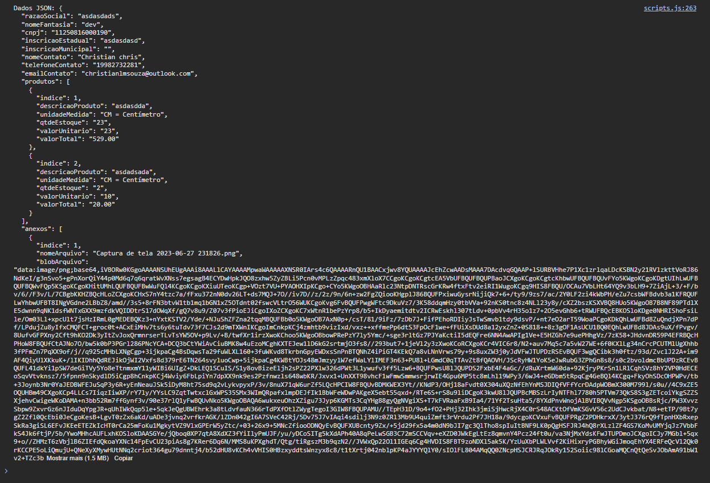

## Desafio VFlows

Este projeto é uma aplicação para gerenciar informações de fornecedores e produtos. Ele permite o cadastro de dados, como informações de contato e produtos, e o upload de anexos. A aplicação inclui funcionalidades como busca de endereço pelo CEP, cálculos de valores de produtos e exibição de modais para confirmar ações.

## Tecnologias Utilizadas

- HTML5
- CSS3
- JavaScript
- API Via Cep

## Funcionalidades

- **Busca de Endereço:** Busca e preenche automaticamente os campos de endereço com base no CEP fornecido.
- **Gerenciamento de Produtos:** Adiciona, edita e calcula valores de produtos.
- **Upload de Anexos:** Permite a inclusão de arquivos e exibe os anexos na interface.
- **Validação de Formulário:** Verifica se todos os campos obrigatórios estão preenchidos antes de salvar.
- **Modais:** Exibe um modal de sucesso após a submissão do formulário.

## Uso

1. Preencha o campo de CEP para buscar e preencher automaticamente os campos de endereço.
2. Adicione produtos clicando no botão "Adicionar Produto" e preencha as informações necessárias.
3. Faça o upload de anexos clicando no botão "Adicionar Anexo".
4. Verifique se todos os campos obrigatórios estão preenchidos e clique em "Salvar" para submeter o formulário.
5. Um modal de sucesso será exibido se todos os campos estiverem corretos e pelo menos um arquivo estiver anexado.
6. Será gerado json no console com as informações preenchidas.

## Imagens do projeto

## Cadastro

 
## Adicionar Produtos

 
## Modal

 
## Dados em json

